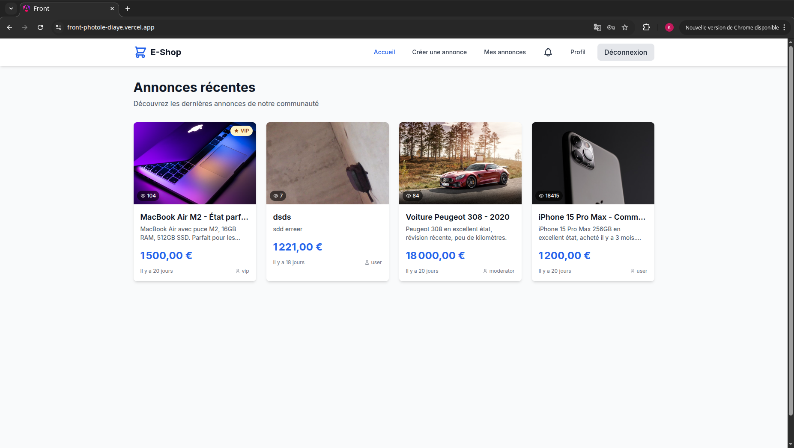
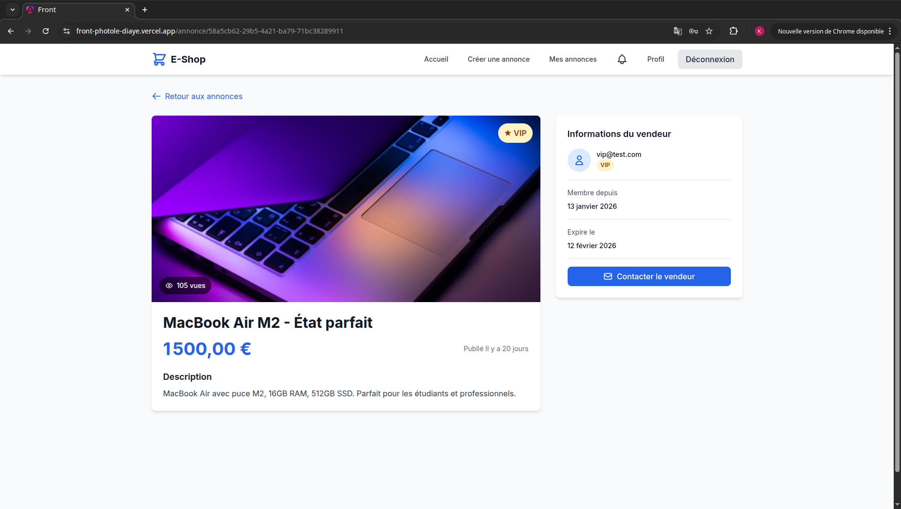

# SamaOMPay - Plateforme de Petites Annonces

[](https://angular.io/)
[](https://www.typescriptlang.org/)
[](https://tailwindcss.com/)
[](https://laravel.com/)

## 📋 Description du Projet

**PhotolDiaye** est une plateforme moderne de petites annonces développée en Angular 20 (frontend) et Laravel (backend API REST). L'application permet aux utilisateurs de créer, consulter et gérer des annonces avec un système de modération intégré.

Ce dépôt contient le **frontend Angular** de l'application. Le backend Laravel est disponible dans un dépôt séparé.

### 🎯 Objectifs du Projet

- Fournir une expérience utilisateur fluide et intuitive sur mobile et desktop
- Garantir la qualité des annonces grâce à un système de modération
- Assurer la sécurité des données utilisateurs avec une authentification robuste
- Optimiser les performances avec une architecture lazy loading

---

## 🛠️ Stack Technique

### Frontend

| Technologie | Version | Description |
|-------------|---------|-------------|
| **Angular** | 20.3.0 | Framework SPA moderne avec Signals |
| **TypeScript** | 5.9.2 | Typage statique sécurisé |
| **RxJS** | 7.8.0 | Programmation réactive |
| **TailwindCSS** | 3.4.18 | Framework CSS utilitaire |
| **Angular SSR** | 20.3.5 | Server-Side Rendering |

### Outils de Développement

- **Angular CLI** - Gestionnaire de projet
- **Karma/Jasmine** - Tests unitaires
- **Prettier** - Formatage de code
- **ESLint** - Analyse statique du code

---

## ✨ Fonctionnalités Principales

### 🔐 Authentification & Sécurité

- **JWT (JSON Web Token)** avec access token et refresh token
- **Gestion des rôles** : USER, VIP, MODERATOR
- **Protection des routes** via guards Angular
- **Intercepteurs HTTP** pour l'injection automatique du token
- **Validation des tokens** avec vérification d'expiration

### 📝 Gestion des Annonces

- **Création d'annonces** avec formulaire réactif
- **Validation des données** côté client
- **Capture de photos** via caméra (mobile)
- **Upload d'images** en base64
- **Liste des annonces** paginée
- **Détail d'une annonce** avec compteur de vues

### 👤 Espace Utilisateur

- **Profil utilisateur** avec historique
- **Gestion de mes annonces**
- **Notifications** en temps réel
- **Tableau de bord** personnalisé

### 🛡️ Système de Modération

- **Interface d'administration** dédiée
- **Approbation/Rejet** des annonces
- **Filtrage** par statut (en attente, validé, rejeté)
- **Contrôle d'accès** basé sur les rôles

---

## 🏗️ Architecture du Projet

```
src/
├── app/
│   ├── core/                    # Services, guards, models partagés
│   │   ├── guards/              # Protection des routes
│   │   │   ├── auth.guard.ts    # Vérification authentification
│   │   │   ├── user.guard.ts    # Accès utilisateur standard
│   │   │   └── moderator.guard.ts # Accès modérateur
│   │   ├── interceptors/        # Intercepteurs HTTP
│   │   │   └── auth.interceptor.ts
│   │   ├── models/              # Interfaces TypeScript
│   │   │   ├── annonce.model.ts
│   │   │   ├── user.model.ts
│   │   │   └── notification.model.ts
│   │   └── services/            # Services métier
│   │       ├── auth.service.ts
│   │       ├── annonce.service.ts
│   │       ├── camera.service.ts
│   │       └── notification.service.ts
│   ├── features/                # Modules fonctionnels (lazy loading)
│   │   ├── auth/                # Authentification
│   │   │   ├── login/
│   │   │   └── register/
│   │   ├── annonce/             # Gestion des annonces
│   │   │   ├── annonce-create/
│   │   │   └── annonce-detail/
│   │   ├── home/                # Page d'accueil
│   │   ├── profile/             # Profil utilisateur
│   │   ├── moderation/          # Interface admin
│   │   └── notifications/       # Centre de notifications
│   └── shared/                  # Composants réutilisables
│       └── components/
│           └── navbar/
├── environments/                # Configuration par environnement
└── styles.css                   # Styles globaux
```

### Design Patterns Utilisés

- **Dependency Injection** - Injection de services Angular
- **Signals** - Gestion d'état réactive (Angular 20)
- **Observable Pattern** - Flux de données asynchrones
- **Repository Pattern** - Abstraction des appels API
- **Factory Pattern** - Création d'objets complexes

---

## 🔒 Modèle de Données

### User (Utilisateur)

```typescript
interface User {
  id: string;
  email: string;
  role: 'USER' | 'VIP' | 'MODERATOR';
  createdAt: string;
  updatedAt?: string;
}
```

### Annonce (Petite Annonce)

```typescript
interface Annonce {
  id: string;
  title: string;
  description: string;
  imageUrl: string;
  price: number;
  views: number;
  isActive: boolean;
  isModerated: boolean;
  expiresAt: string;
  createdAt: string;
  updatedAt: string;
  userId: string;
  user: User;
}
```

---

## 📡 API Endpoints (Backend Laravel)

### Authentication

| Méthode | Endpoint | Description |
|---------|----------|-------------|
| POST | `/api/auth/register` | Inscription |
| POST | `/api/auth/login` | Connexion |
| POST | `/api/auth/logout` | Déconnexion |
| POST | `/api/auth/refresh` | Rafraîchir le token |

### Annonces

| Méthode | Endpoint | Description |
|---------|----------|-------------|
| GET | `/api/annonces` | Liste des annonces |
| POST | `/api/annonces` | Créer une annonce |
| GET | `/api/annonces/:id` | Détail d'une annonce |
| PUT | `/api/annonces/:id` | Modifier une annonce |
| DELETE | `/api/annonces/:id` | Supprimer une annonce |

### Modération

| Méthode | Endpoint | Description |
|---------|----------|-------------|
| GET | `/api/moderation/annonces` | Annonces en attente |
| POST | `/api/moderation/annonces/:id/action` | Approuver/Rejeter |

### Utilisateur

| Méthode | Endpoint | Description |
|---------|----------|-------------|
| GET | `/api/user/profile` | Profil utilisateur |
| GET | `/api/user/annonces` | Annonces de l'utilisateur |

---

## 🚀 Installation & Démarrage

### Prérequis

- Node.js 18+ 
- npm 10+ ou yarn
- Angular CLI 20

### Installation

```bash
# Cloner le projet
git clone https://github.com/KalidouGUISSE/front-photoleDiaye

# Installer les dépendances
npm install

# Configurer les variables d'environnement
cp .env.example .env
# Éditer .env avec vos valeurs
```

### Démarrage

```bash
# Mode développement
npm start

# Mode production
npm run build

# Serveur de production
npm run serve:ssr:front
```

### Variables d'Environnement

```env
API_URL=http://localhost:8000/api
```

---

## 📱 Aperçu de l'Application

### Tableau de Bord



### Création d'une Annonce (Mobile)


### Visualisation d'une Annonce



### Interface Mobile


---

## 🔐 Sécurité

### Mesures Implémentées

1. **Authentification JWT**
   - Access token avec expiration courte
   - Refresh token pour renouveler les sessions
   - Stockage sécurisé dans localStorage

2. **Protection des Routes**
   - Guards Angular pour chaque niveau d'accès
   - Vérification serveur des permissions

3. **Validation des Données**
   - Formulaires réactifs avec validateurs
   - Sanitization des entrées utilisateur

4. **Intercepteurs HTTP**
   - Injection automatique du token dans les requêtes
   - Gestion des erreurs centralisée

---

## 📊 Performance

### Optimisations

- **Lazy Loading** - Chargement différé des modules
- **Server-Side Rendering (SSR)** - Amélioration SEO et First Contentful Paint
- **Tree Shaking** - Élimination du code mort
- **Bundle Optimization** - Code splitting automatique

### Métriques Cibles

| Métrique | Cible |
|----------|-------|
| First Contentful Paint | < 1s |
| Time to Interactive | < 2s |
| Bundle Size Initial | < 500kB |
| Lighthouse Score | > 90 |

---

## 🧪 Tests

```bash
# Tests unitaires
npm run test

# Tests avec couverture
npm run test -- --code-coverage
```

---

## 📚 Documentation Complémentaire

- [Guide d'installation](SETUP.md)
- [Architecture détaillée](ARCHITECTURE.md)
- [Guide de démarrage rapide](QUICK_START.md)

---

## 👥 Contribution

Les contributions sont les bienvenues ! Veuillez lire le guide de contribution avant de soumettre une pull request.

### Standards de Code

- TypeScript strict activé
- Prettier pour le formatage
- Conventional Commits
- Tests unitaires requis

---

## 📄 Licence

Ce projet est sous licence MIT.

---

## 📞 Contact

- **Développeur** : Kalidou Guissé
- **Email** : guissedev@gmail.com

---

<div align="center">

**Développé avec ❤️ et Angular**

</div>
